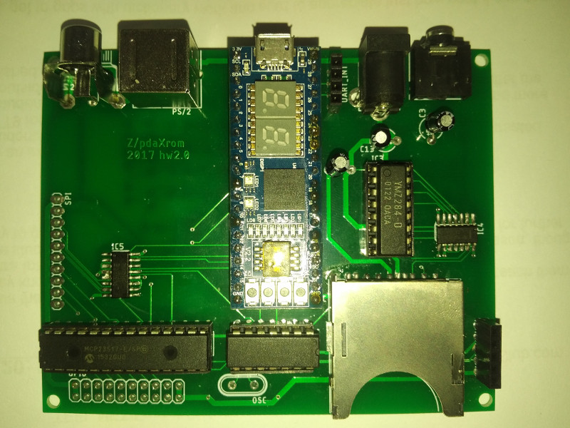

## Pyldin-601 compatible retrocomputer.

[History](docs/HISTORY.md)

### Overview hardware version 2.0:

 Function | Description 
----|----
CPU | [System 11 - VHDL 68HC11](http://members.optusnet.com.au/jekent/system11/)
FPGA| [Lattice MachXO2-4000HC module](http://www.stepfpga.com)
RAM | Builtin FPGA 4KB and/or external static serial ram 2x128KB
ROM | Builtin FPGA BOOTROM 2KB
Keyboard | PS/2
Serial port | 1 serial port and 1 UART (rx/tx only)
Parallel port | 2x8bit
Video | TV (color, 8bit DAC)
Audio | YMZ284-D (mono)
Storage | MMC/SD
Other | Onboard SPI, 4 CS ports and Reset.
